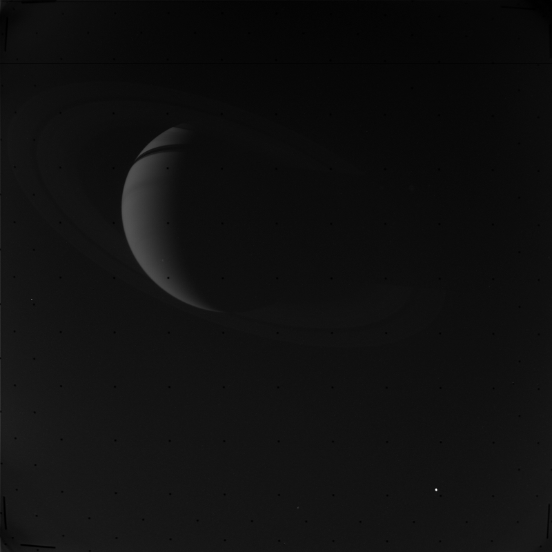

# 🛰️PDS2img

<figure style="margin: 0 auto; text-align: center">



</figure>

[NASA Planetary Data System (PDS)](https://pds.nasa.gov/) to PNG/TIFF conversion library.

## Usage

PDS3 (Voyager, Galileo, Cassini, etc.)

```ts
import { loadPDS3ImageByUrl, toPNG, toTIFF } from 'pds2image';

const imgUrl = '/data/C3593229_RAW.IMG';

// Load and parse PDS3 product
const image = await loadPDS3ImageByUrl(imgUrl);

// Convert to PNG / TIFF ArrayBuffer
const pngBuffer = toPNG(image);
const tiffBuffer = toTIFF(image);
```

PDS4 (Modern spacecraft image)

```ts
import { loadPDS4ImageByUrl, toPNG, toTIFF } from 'pds2image';

const xmlUrl =
  '/data/FLG_1739_0821318674_675RAS_N0830000FHAZ00505_0A01I4J01.xml';
const imgUrl =
  '/data/FLG_1739_0821318674_675RAS_N0830000FHAZ00505_0A01I4J01.IMG';

// Load and parse PDS4 product
const image = await loadPDS4ImageByUrl(xmlUrl, imgUrl);

// Convert to PNG / TIFF ArrayBuffer
const pngBuffer = toPNG(image);
const tiffBuffer = toTIFF(image);
```

PDS4 (File System Access API)

```ts
import { loadPDSImageArrayBufferFromDirectory } from 'pds2image';

// Browser only: user picks a directory that contains .xml + referenced .IMG
const directoryHandle = await window.showDirectoryPicker();
const float32Buffer =
  await loadPDSImageArrayBufferFromDirectory(directoryHandle);

console.log(float32Buffer.byteLength);
```

Save PNG / TIFF in browser

```ts
function saveArrayBuffer(
  buffer: ArrayBuffer,
  mimeType: string,
  filename: string,
): void {
  const blob = new Blob([buffer], { type: mimeType });
  const url = URL.createObjectURL(blob);

  const anchor = document.createElement('a');
  anchor.href = url;
  anchor.download = filename;
  anchor.click();

  URL.revokeObjectURL(url);
}

// Example usage with previous PDS4 sample variables
saveArrayBuffer(pngBuffer, 'image/png', 'pds4-output.png');
saveArrayBuffer(tiffBuffer, 'image/tiff', 'pds4-output.tiff');
```

Save PNG / TIFF with user-selected location (File System Access API)

```ts
async function saveArrayBufferWithPicker(
  buffer: ArrayBuffer,
  mimeType: string,
  suggestedName: string,
): Promise<void> {
  // Fallback for browsers that do not support File System Access API
  if (!('showSaveFilePicker' in window)) {
    const blob = new Blob([buffer], { type: mimeType });
    const url = URL.createObjectURL(blob);

    const anchor = document.createElement('a');
    anchor.href = url;
    anchor.download = suggestedName;
    anchor.click();

    URL.revokeObjectURL(url);
    return;
  }

  const handle = await window.showSaveFilePicker({
    suggestedName,
    types: [
      {
        description: mimeType,
        accept: {
          [mimeType]: [suggestedName.endsWith('.tiff') ? '.tiff' : '.png'],
        },
      },
    ],
  });

  const writable = await handle.createWritable();
  await writable.write(buffer);
  await writable.close();
}

// Example usage with previous PDS4 sample variables
await saveArrayBufferWithPicker(pngBuffer, 'image/png', 'pds4-output.png');
await saveArrayBufferWithPicker(tiffBuffer, 'image/tiff', 'pds4-output.tiff');
```

CLI

```bash
# Build library first (CLI reads from dist/)
pnpm run build

# PDS3 example (creates C3592903_RAW.png)
bin/pds2img -i C3592903_RAW -type png

# Explicit input path and output path
bin/pds2img -i ./tests/data/C3592903_RAW -type tiff -o ./tests/data/out.tiff

# Directory mode: convert all supported datasets in a directory
bin/pds2img -d ./tests/data -type png

# Directory mode with explicit output directory
bin/pds2img -d ./tests/data -type tiff -o ./tests/out
```

Notes:

- `-i` accepts a base path (`C3592903_RAW`), `.IMG` path, or `.xml` path.
- `-d` converts all datasets in a directory: PDS3 (`.IMG + .LBL`) and PDS4 (`.xml`).
- Detection order for base path input is PDS3 (`.IMG + .LBL`) then PDS4 (`.xml`).
- In directory mode, `-o` is treated as an output directory.
- On Windows PowerShell, run `./bin/pds2img.cmd ...`.

## Setup

Install the dependencies:

```bash
pnpm install
```

## Get started

Build the app for production:

```bash
pnpm run build
```

## License

©2026 by Logue.
Licensed under the [MIT License](LICENSE).
